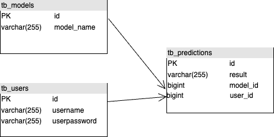
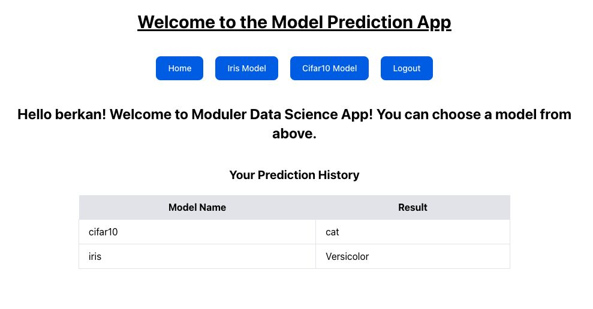
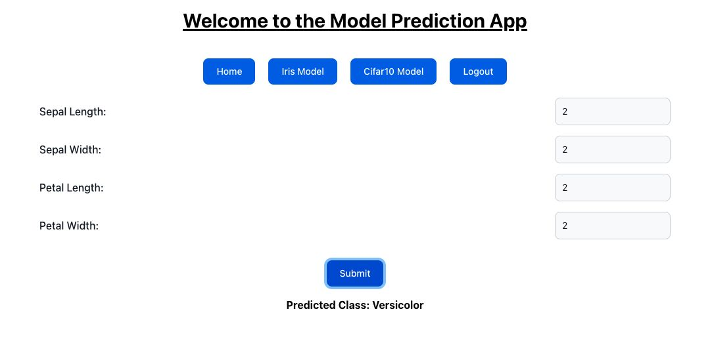
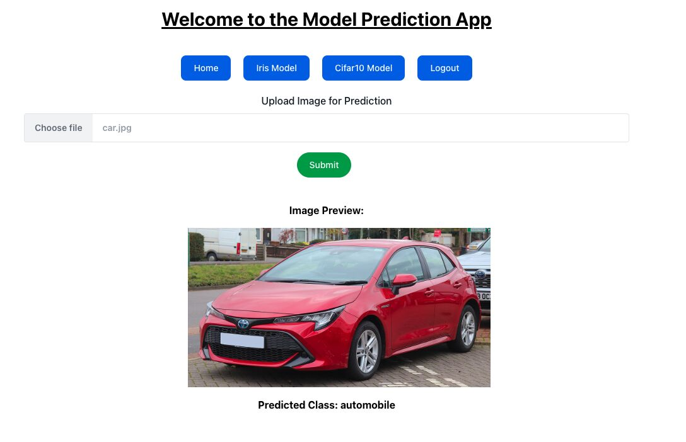

# **TF Serving Example**

This project enables the execution of various artificial intelligence models and stores the prediction results in a database.

Prediction results are saved based on the logged-in user and the model used. The database schema is illustrated below:



## **How to Run the Project**

### 1. Build Spring Boot
You need to compile Spring Boot without database test.

```bash
cd backend
mvn clean install -DskipTests
```

### 2. Build and Start the Project
Navigate to the project directory and execute the following command:

```bash
docker-compose up --build
```

If you don't use ARM processor you should use docker-compose-amd.yml file.

### 3. Load the Database Backup

**Step 1:** Open a new terminal and connect to the PostgreSQL container. Then, create a backup folder:

```bash
docker exec -it postgres bash
mkdir /backup
```

**Step 2:** In another terminal, copy the backup file to the PostgreSQL container:

```bash
docker cp database/backup/backup.sql postgres:/backup/backup.sql
```

**Step 3:** Switch back to the PostgreSQL terminal and restore the backup:

```bash
psql -U postgres -d tf_serving -f /backup/backup.sql
```

### Screenshots





